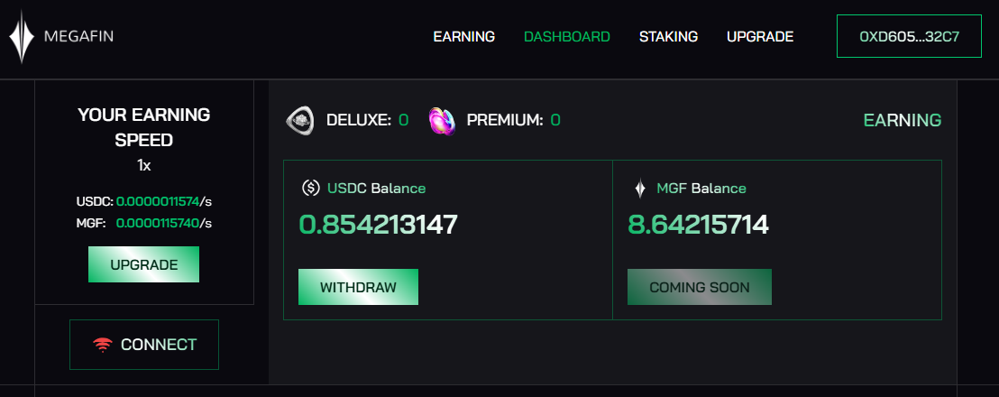

# MEGAFIN NETWORK
Earning by sharing internet bandthwith [https://app.megafin.xyz/dashboard](https://app.megafin.xyz/upgrade)


## Features

- **Register New Wallets**: Create multiple Ethereum wallets and register them on the Megafin platform.
- **For Now its not support Multy accounts** There have been added rate limited request to server.
- **Load Existing Tokens**: Load pre-existing tokens and verify their validity. Automatically re-authenticate expired tokens.
- **Captcha Solving Integration**: Uses an external API key to solve captchas for wallet registration.
- **Token Management**: Saves wallet data and tokens securely in a JSON file.

## Requirements

- **Node.js**: Ensure you have Node.js installed. Recommended version: 20+
- **Dependencies**: Install necessary dependencies with `npm install`.
- **API Key**: A valid 2Captcha API key to handle captchas. [Get your API Key here](https://2captcha.com/)

## Installation

1. Clone this repository:
    ```bash
    git clone https://github.com/Rambeboy/megafin-network-bot.git && cd megafin-network-bot
    ```
2. Install dependencies:
    ```bash
    npm install
    ```
3. Run The Script:
    ```bash
    npm run start
    ```
4. Follow the instructions in the terminal to complete the setup.

## Disclaimer

This bot is for educational purposes only. Use at your own risk and ensure you comply with Megafin Network terms of service.

## License

This project is licensed under the MIT License - see the [LICENSE](LICENSE) file for details.
